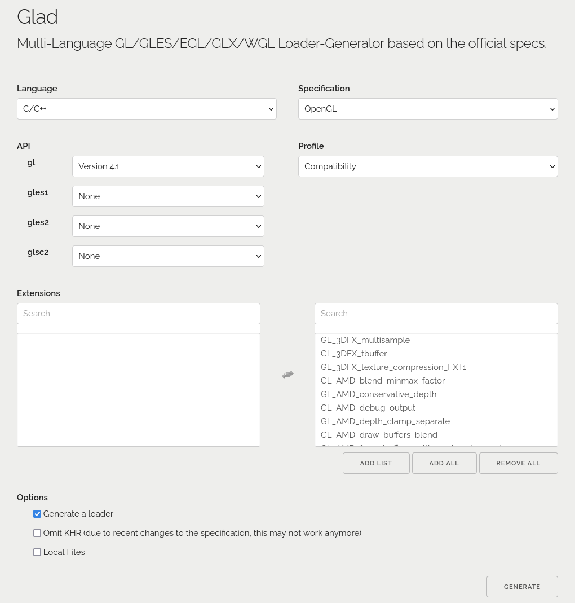

# TODO's
- [x] FPS Camera system
- [x] Arcball Camera system
- [x] Code cleanup
- [x] Functionality to switch between different xcamera systems (via some kind of button?)
- [x] Currently after switching camera, the position resets. This is not a desired behavior. If I switch camera after having moved to a certain position while I was in FPS camera, then the camera should switch to arcball on the spot and not move me back to where I was.
- [ ] Figure out better way to display the cube? (not that important now)
- [ ] Integrate Bullet3 physics
- [ ] More code cleanup

# Dependencies
> [!NOTE]
> This assumes your machine has OpenGL support.

1. SDL2
2. Bullet3
3. OpenGL Mathematics (GLM)

For 3. OpenGL Mathematics (GLM), you don't need to do anything, it's taken care of in `CMakeLists.txt`.

# Installation

## Installing SDL2
```bash
sudo apt-get install libsdl2-2.0-0
sudo apt-get install libsdl2-dev
```

## Installing/Using Glad
This setup uses Glad to include OpenGL functionalities: https://glad.dav1d.de/

For the settings, see the image below. Click `ADD ALL` after selecting `API->gl->Version 4.1`.

Then, after generating the necessary files, extract the zip file and paste the `glad` folder and `KHR` folder into the `include` directory. Put the `glad.c` file into the `src` directory. That's it! The `CMakeLists.txt` file is already set up to work with this setup.



## Installing Bullet3 & Using `vcpkg` with CMake buildsystem
First, install `vcpkg`. Run the command below, preferably in your `/home` directory (anywhere is fine as long as you remember where you installed it since we need to add to `PATH` later):
```bash
git clone https://github.com/Microsoft/vcpkg.git
cd vcpkg
./bootstrap-vcpkg.sh
./vcpkg integrate install
./vcpkg install bullet3
```

> [!IMPORTANT]
> After running the `./vcpkg integrate install`, you will see something like the following on your terminal:
> `CMake projects should use: "-DCMAKE_TOOLCHAIN_FILE=<some_path>/vcpkg.cmake"`.
> Remember this since you will need this later, let's call this `some_path` as `dcmake_toolchain_file_path`.

Now, add `vcpkg` to `PATH`. Assuming you installed it in your `/home` directory earlier, then to do this add this line to your `.zshrc` (or `.bashrc` or whichever shell you are using):
```bash
export PATH="$HOME/vcpkg:$PATH"
```

Next, go to the project directory, where you clone this repo, call it directory `d`. Then, run the command below in `d`:
```bash
vcpkg new --application
```

The command above will create a file `vcpkg.json`. Then, run the following command:
```bash
vcpkg add port bullet3
```

After running the above command, your `vcpkg.json` should look like the following:
```json
{
  "dependencies": [
    "bullet3"
  ]
}
```

Finally, creata a file `CMakePresets.json` containing the following:
```json
{
  "version": 2,
  "configurePresets": [
    {
      "name": "default",
      "generator": "Ninja",
      "binaryDir": "${sourceDir}/build",
      "cacheVariables": {
        "CMAKE_TOOLCHAIN_FILE": "dcmake_toolchain_file_path/vcpkg.cmake"
      }
    }
  ]
}
```

Where `dcmake_toolchain_file_path` is the `some_path` mentioned in the first step.

# Building & Running
The script `build.sh` included in this repo is what I use to build most of my C++ projects and it works in most, if not all, kinds of C++ projects variations. Feel free to build this project in whichever method you prefer.

If you are using the script `build.sh`, then building and running this project is as simple as:
```bash
./build.sh
./LearningOpenGL
```
